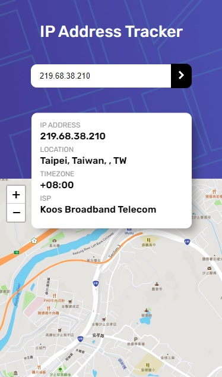

# IP Address Tracker


React application to track IP address

Installation
--------------------


```sh
git clone git@github.com:PierreBeaufils/ip-tracker.git
or git clone https://github.com/PierreBeaufils/ip-tracker.git

cd ip-tracker

# install dependencies
yarn 

# Launch dev server
yarn start 

# Open http://localhost:8080/
```


---

Overview
-------------------------------------------

